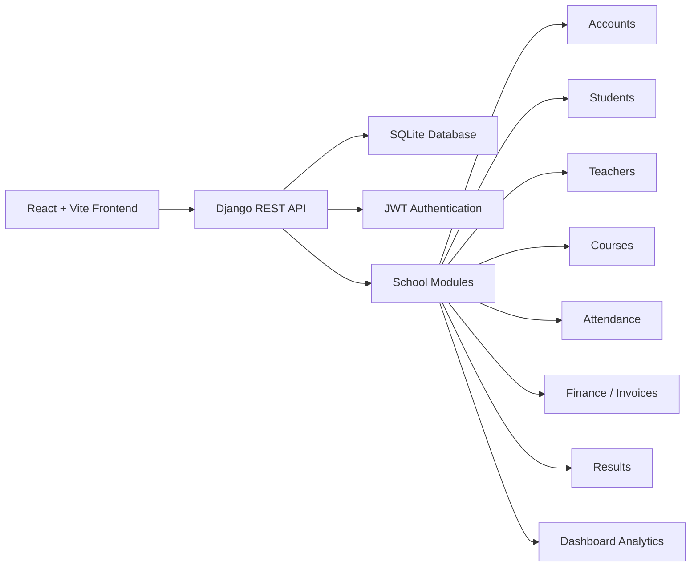

# H-School Management System

A modern school administration platform built as a full-stack web application for managing students, teachers, courses, attendance, results, and finance. This project is designed to showcase practical software engineering skills: REST APIs, authentication, role-based access, modular Django apps, and a React/Vite dashboard interface.

---

## 1. What this project does

This system provides a simple but complete school management workflow for:

- User authentication and authorization
- Student and teacher management
- Course management
- Attendance tracking
- Result/grade management
- Invoice and finance monitoring
- Admin dashboard analytics

In short, it acts like a mini ERP for academic operations, focused on the core day-to-day tasks of a school administration team.

---

## 2. Why this project matters (case-study angle)

This repository is a strong portfolio project because it demonstrates:

- Full-stack development with Django + React
- REST API design and backend modularization
- Authentication with JWT
- Clean database modeling for education workflows
- Role-based access control
- Dashboard-driven reporting and analytics
- A scalable folder structure suitable for future production upgrades

It is ideal for showing on LinkedIn, GitHub, or freelance platforms as a real-world example of building a business-facing web application.

---

## 3. High-level architecture

The project follows a classic client-server architecture:



### Architecture summary

- Frontend: React + Vite + Tailwind CSS
- Backend: Django + Django REST Framework
- Database: SQLite (current implementation)
- Authentication: JWT via Simple JWT
- API structure: Modular app-based architecture
- Security: CORS enabled, JWT-protected API endpoints, admin permission checks

---

## 4. Core modules

### Backend modules

The backend is organized into separate Django apps under the `backend/` folder:

- `accounts` - registration, login, JWT auth, user profile, role-based access
- `students` - student records and student-related management
- `teachers` - teacher profiles and assignments
- `courses` - course catalog and teacher linkage
- `attendance` - attendance entry and student attendance status
- `finance` - invoices and payment-related tracking
- `results` - student marks and grades
- `dashboard` - summary metrics for admin reports

### Frontend layer

The frontend is built with:

- React
- Vite
- React Router
- Tailwind CSS
- Recharts / Framer Motion / Lucide icons

It is designed to provide a clean user interface for dashboard and CRUD workflows.

---

## 5. What the system is currently doing

From the codebase structure and implementation, the project currently supports:

1. User registration and login
2. JWT token-based session management
3. Viewing authenticated user information
4. Dashboard summary endpoints such as:
   - total students
   - total teachers
   - total courses
   - total invoices
   - unpaid invoices
5. CRUD-style API modules for academic and finance records

This makes the project usable as a practical management dashboard for a school administration scenario.

---

## 6. Technical stack

### Backend

- Python
- Django
- Django REST Framework
- Django Simple JWT
- Django Filters
- SQLite

### Frontend

- JavaScript / React
- Vite
- Tailwind CSS
- React Router
- Axios / fetch-based API communication
- Recharts for data visualization

---

## 7. Folder structure

```text
backend/
  accounts/         # auth, users, JWT
  students/         # student management
  teachers/         # teacher management
  courses/          # courses
  attendance/       # attendance tracking
  finance/          # invoices and billing
  results/          # grades and results
  dashboard/        # analytics summary
  core/             # Django settings and main URL routing

frontend/
  src/              # React application source (if present in your working version)
  package.json      # frontend dependencies and scripts
  vite.config.js    # Vite configuration
```

---

## 8. Data flow

1. A user logs in through the frontend.
2. The frontend receives a JWT access token.
3. The token is attached to API requests.
4. Django REST API validates the token and serves protected data.
5. The dashboard and management pages display the returned information.
6. Records are stored in the SQLite database through Django models.

This is a clean, standard architecture for a small-to-medium school system.

---

## 9. Strengths of the project

- Clear separation of concerns between frontend and backend
- Modular Django app structure
- Reusable API patterns
- Role-based access and secure auth foundations
- Easy to extend for additional modules like payments, reports, notifications, and mobile support

---

## 10. Future improvements

This project is already a solid foundation, and it can be upgraded into a production-grade system by adding:

- PostgreSQL instead of SQLite
- Payment gateway integration for school fees
- Email/SMS notifications
- Advanced analytics and charts
- File uploads for student records
- Role-based dashboards for admin, teacher, and student users
- Deployment using Docker, Nginx, and cloud hosting

---

## 11. Quick start

### Backend

```bash
cd backend
python -m venv venv
source venv/bin/activate   # Linux/macOS
venv\Scripts\activate      # Windows
pip install -r requirements.txt
python manage.py migrate
python manage.py runserver
```

### Frontend

```bash
cd frontend
npm install
npm run dev
```

---

## 12. Project summary for LinkedIn / portfolio

This project is a school management system built with Django REST Framework and React, covering authentication, academic records, attendance, finance, and dashboard analytics. It demonstrates practical full-stack development, API architecture, and modular backend design, making it an excellent portfolio piece for software developers, freelancers, and students showcasing real-world web application skills.
